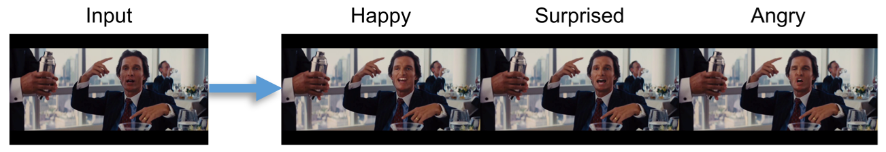
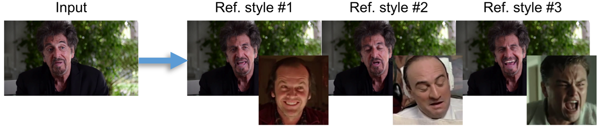

## Neural Emotion Director (NED) - Official Pytorch Implementation (CVPR 2022 Oral, Best Paper Finalist)


Example video of facial emotion manipulation while retaining the original mouth motion, i.e. speech. We show examples of 3 basic emotions.

<br><br>
This repository contains the source code for our paper:
> **Neural Emotion Director: Speech-preserving semantic control of facial expressions in “in-the-wild” videos**<br>
> Foivos Paraperas Papantoniou, Panagiotis P. Filntisis, Petros Maragos, Anastasios Roussos<br>

> Project site:
https://foivospar.github.io/NED/<br>

> **Abstract:** *In this paper, we introduce a novel deep learning method for photo-realistic manipulation of the emotional state of actors in ``in-the-wild'' videos. The proposed method is based on a parametric 3D face representation of the actor in the input scene that offers a reliable disentanglement of the facial identity from the head pose and facial expressions. It then uses a novel deep domain translation framework that alters the facial expressions in a consistent and plausible manner, taking into account their dynamics. Finally, the altered facial expressions are used to photo-realistically manipulate the facial region in the input scene based on an especially-designed neural face renderer. To the best of our knowledge, our method is the first to be capable of controlling the actor’s facial expressions by even using as a sole input the semantic labels of the manipulated emotions, while at the same time preserving the speech-related lip movements. We conduct extensive qualitative and quantitative evaluations and comparisons, which demonstrate the effectiveness of our approach and the especially promising results that we obtain. Our method opens a plethora of new possibilities for useful applications of neural rendering technologies, ranging from movie post-production and video games to photo-realistic affective avatars.*

## Updates
**6/10/2022:** A few more additions on the training of the Manipulator (using Aff-Wild2), see [here](#training-on-aff-wild2).

**22/08/2022:** We have added code and [instructions](#optional-train-the-emotion-manipulator) for the training of the Emotion Manipulator.

## Getting Started
Clone the repo:
  ```bash
  git clone https://github.com/foivospar/NED
  cd NED
  ```  

### Requirements
Create a conda environment, using the provided ```environment.yml``` file.
```bash
conda env create -f environment.yml
```
Activate the environment.
```bash
conda activate NED
```

### Files
1. Follow the instructions in [DECA](https://github.com/YadiraF/DECA) (under the *Prepare data* section) to acquire the 3 files ('generic_model.pkl', 'deca_model.tar', 'FLAME_albedo_from_BFM.npz') and place them under "./DECA/data".
2. Fill out the [form](https://docs.google.com/forms/d/e/1FAIpQLScyyNWoFvyaxxfyaPLnCIAxXgdxLEMwR9Sayjh3JpWseuYlOA/viewform) to get access to the [FSGAN](https://github.com/YuvalNirkin/fsgan)'s pretrained models. Then download 'lfw_figaro_unet_256_2_0_segmentation_v1.pth' (from the "v1" folder) and place it under "./preprocessing/segmentation".

## Video preprocessing
To train or test the method on a specific subject, first create a folder for this subject and place the video(s) of this subject into a **"videos"** subfolder. To acquire the training/test videos as well as some of the reference videos used in our experiments, please [contact us](mailto:phoebus1998p@gmail.com).

For example, for testing the method on Tarantino's clip, a structure similar to the following must be created:
```
Tarantino ----- videos ----- Tarantino_t.mp4
```
Under the above structure, there are 3 options for the video(s) placed in the "videos" subfolder:
1. Use it as test footage for this actor and apply our method for manipulating his/her emotion.
2. Use this footage to train a neural face renderer on the actor (e.g. use the training video of one of our 6 YouTube actors, or a footage of similar duration for a new identity).
3. Use it only as reference clip for transferring the expressive style of the actor to another subject.

To preprocess the video (face detection, segmentation, landmark detection, 3D reconstruction, alignment) run:
```bash
./preprocess.sh <celeb_path> <mode>
```
- ```<celeb_path>``` is the path to the folder used for this actor.
- ```<mode>``` is one of ```{train, test, reference}``` for each of the above cases respectively.

After successfull execution, the following structure will be created:

```
<celeb_path> ----- videos -----video.mp4 (e.g. "Tarantino_t.mp4")
                   |        |
                   |        ---video.txt (e.g. "Tarantino_t.txt", stores the per-frame bounding boxes, created only if mode=test)
                   |
                   --- images (cropped and resized images)
                   |
                   --- full_frames (original frames of the video, created only if mode=test or mode=reference)
                   |
                   --- eye_landmarks (landmarks for the left and right eyes, created only if mode=train or mode=test)
                   |
                   --- eye_landmarks_aligned (same as above, but aligned)
                   |
                   --- align_transforms (similarity transformation matrices, created only if mode=train or mode=test)
                   |
                   --- faces (segmented images of the face, created only if mode=train or mode=test)
                   |
                   --- faces_aligned (same as above, but aligned)
                   |
                   --- masks (binary face masks, created only if mode=train or mode=test)
                   |
                   --- masks_aligned (same as above, but aligned)
                   |
                   --- DECA (3D face model parameters)
                   |
                   --- nmfcs (NMFC images, created only if mode=train or mode=test)
                   |
                   --- nmfcs_aligned (same as above, but aligned)
                   |
                   --- shapes (detailed shape images, created only if mode=train or mode=test)
                   |
                   --- shapes_aligned (same as above, but aligned)
```
## 1.Manipulate the emotion on a test video
Download our pretrained manipulator from [here](https://drive.google.com/drive/folders/1fLAsB2msBcLnRJWlixXt-hJ8FeX3Az6T?usp=sharing) and unzip the checkpoint.

Also, preprocess the test video for one of our target YouTube actors or use a new actor (requires training a new neural face renderer).

For our YouTube actors, we provide pretrained renderer models [here](https://drive.google.com/drive/folders/1vBVeiBvVP_fZ5jPSv7yd7OsdiI22Mwnd?usp=sharing). Download the .zip file for the desired actor and unzip it.

Then, assuming that preprocessing (in **test** mode) has been performed for the selected test video (see [above](#video-preprocessing)), you can manipulate the expressions of the celebrity in this video by one of the following 2 ways:

#### 1.Label-driven manipulation



Select one of the 7 basic emotions (happy, angry, surprised, neutral, fear, sad, disgusted) and run :
```bash
python manipulator/test.py --celeb <celeb_path> --checkpoints_dir ./manipulator_checkpoints --trg_emotions <emotions> --exp_name <exp_name>
```
- ```<celeb_path>``` is the path to the folder used for this actor's test footage (e.g. "./Tarantino").
- ```<emotions>``` is one or more of the 7 emotions. If one emotion is given, e.g. ```--trg_emotions happy```, all the video will be converted to happy, whereas for 2 emotions or more, such as ```--trg_emotions happy angry``` the first half of the video will be happy, the second half angry and so on.
- ```<exp_name>``` is the name of the sub-folder that will be created under the ```<celeb_path>``` for storing the results.

#### 2.Reference-driven manipulation



In this case, the reference video should first be preprocessed (as described [above](#video-preprocessing)) in **reference** mode. Then run:
```bash
python manipulator/test.py --celeb <celeb_path> --checkpoints_dir ./manipulator_checkpoints --ref_dirs <ref_dirs> --exp_name <exp_name>
```
- ```<celeb_path>``` is the path to the folder used for this actor's test footage (e.g. "./Tarantino").
- ```<ref_dirs>``` is one or more reference videos. In particular, the path to the "DECA" sublfolder has to be given. As with labels, more than one paths can be given, in which case the video will be transformed sequentially according to those reference styles.
- ```<exp_name>``` is the name of the sub-folder that will be created under the <celeb_path> for storing the results.


Then, run:
```bash
./postprocess.sh <celeb_path> <exp_name> <checkpoints_dir>
```
- ```<celeb_path>``` is the path to the test folder used for this actor.
- ```<exp_name>``` is the name you have given to the experiment in the previous step.
- ```<checkpoints_dir>``` is the path to the pretrained renderer for this actor (e.g. "./checkpoints_tarantino" for Tarantino).

This step performs neural rendering, un-alignment and blending of the modified faces. Finally, you should see the ```full_frames``` sub-folder into ```<celeb_path>/<exp_name>```. This contains the full frames of the video with the altered emotion. To convert them to video, run:
```bash
python postprocessing/images2video.py --imgs_path <full_frames_path> --out_path <out_path> --audio <original_video_path>
```
- ```<full_frames_path>``` is the path to the full frames (e.g. "./Tarantino/happy/full_frames").
- ```<out_path>``` is the path for saving the video (e.g. "./Tarantino_happy.mp4").
- ```<original_video_path>``` is the path to the original video (e.g. "./Tarantino/videos/tarantino_t.mp4"). This argument is optional and is used to add the original audio to the generated video.


## 2.Train a neural face renderer for a new celebrity
Download our pretrained meta-renderer ("checkpoints_meta-renderer.zip") from the link above and unzip the checkpoints.

Assuming that the training video of the new actor has been preprocessed (in **train** mode) as described [above](#video-preprocessing), you can then finetune our meta-renderer on this actor by running:
```bash
python renderer/train.py --celeb <celeb_path> --checkpoints_dir <checkpoints_dir> --load_pretrain <pretrain_checkpoints> --which_epoch 15
```
- ```<celeb_path>``` is the path to the train folder used for the new actor.
- ```<checkpoints_dir>``` is the new path where the checkpoints will be saved.
- ```<load_pretrain>``` is the path with the checkpoints of the pretrained meta-renderer (e.g. "./checkpoints_meta-renderer").

If you omit the ```--load_pretrain``` and ```--which_epoch``` arguments, the renderer will be trained from scratch. Note that in this case you should increase the training epochs (e.g. ```--niter 60```).

You may also want to change the following parameters according to your needs:

- ```<gpu_ids>``` which can be used to train on multiple gpus (e.g. ```--gpu_ids 0,1,2``` to use the first 3 gpus of your machine, default is only gpu 0).
- ```<batch_size>``` which can be increased for faster training if you train on multiple gpus (default batch size is 1).

Note: You can follow the optimization, by viewing 'web/index.html' inside ```<checkpoints_dir>```.

## 3.Preprocess a reference video
If you want to use a reference clip (e.g. from a movie) of another actor to transfer his/her speaking style to your test actor, simply preprocess the reference actor's clip as described [above](#video-preprocessing) (mode=*reference*) and follow the instructions on [Reference-driven manipulation](#2reference-driven-manipulation).


## (Optional) Train the Emotion Manipulator
Here, we provide instructions on how to train the Emotion Manipulator on the [MEAD](https://wywu.github.io/projects/MEAD/MEAD.html) database, in case you want to experiment with the training process of this module (**note that, in contrast to the neural face renderers, the provided trained manipulator is person-agnostic and can be used as it is for new subjects**).

#### Prepare dataset
For the training, we use a subset of the MEAD database (e.g. 4 actors). Let's say you pick the following actors: M003, M009, W029, and M023. First, you should create a folder named 'MEAD_data' with subfolders named 'M003', 'M009' etc. Then, follow the download link in [MEAD](https://wywu.github.io/projects/MEAD/MEAD.html), get the 'video.tar' for each of the selected actors, place them inside the subfolders you created and extract them. Your structure should look like this:
```
MEAD_data ----- M003 ----- video ----- ...
                  |        
                  |      
                  |
                M009 ----- video ----- ...
                  |        
                  |      
                  |
                W029 ----- video ----- ...
                  |        
                  |      
                  |
                M023 ----- video ----- ...             
```
Then, run:
```bash
python preprocessing/reconstruct_MEAD.py --root ./MEAD_data --actors M003 M009 W029 M023
```
This step will perform 3D reconstruction on the videos of the selected actors. The predicted expression parameters will be stored in the corresponding '{actor}_deca.pkl' files inside 'MEAD_data/'.

#### Preprocess example videos for visualization
In order to visualize the training progress using tensorboard, we use Pacino's test video. The expressions from this video are manipulated at the end of every epoch according to the 7 basic emotions, as well as 3 short reference clips. Therefore, you will need to acquire (see [here](#Video-preprocessing)) 'Pacino_t.mp4' from the test videos and the reference videos 'Nicholson_clip.mp4', 'Pacino_clip.mp4' and 'DeNiro_clip.mp4'. After downloading them, place them in the folders provided as you see here:
```
test_examples ----- Pacino ----- videos ----- Pacino_t.mp4

reference_examples ----- Nicholson_clip ----- videos ----- Nicholson_clip.mp4
                               |        
                               |      
                               |
                            Pacino_clip ----- videos ----- Pacino_clip.mp4
                               |        
                               |      
                               |
                            DeNiro_clip ----- videos ----- DeNiro_clip.mp4       
```
Then, preprocess the videos:
```bash
./preprocess.sh test_examples/Pacino/ test
./preprocess.sh reference_examples/Nicholson_clip/ reference
./preprocess.sh reference_examples/Pacino_clip/ reference
./preprocess.sh reference_examples/DeNiro_clip/ reference
```

#### Download the pre-trained checkpoint
Since we have pre-trained our Emotion Manipulator on the Aff-Wild2 database, we also provide the pre-trained checkpoint [here](https://drive.google.com/drive/folders/1fUPYlwzpmSfC24jCOp46Gru9eY6upC1W?usp=sharing). Download the checkpoint and unzip it.

In case you want to repeat the pre-training on Aff-Wild2, see [below](#training-on-aff-wild2).

#### Training
Run:
```bash
python manipulator/train.py --train_root <train_root> --selected_actors <selected_actors> --selected_actors_val <selected_actors_val> --checkpoints_dir ./manipulator_checkpoints_pretrained_affwild2/ --finetune
```
- ```<train_root>``` is the path to the MEAD data (e.g. "./MEAD_data").
- ```<selected_actors>``` and ```<selected_actors_val>``` are the MEAD actors whose videos will be used as training/validation data accordingly (e.g. ```--selected_actors M003 M009 W029``` to use the 3 actors for training and ```--selected_actors_val M023``` to use the remaining one for validation).
- If you omit the ```--finetune``` argument, the Manipulator will be trained from scratch on MEAD, without using the checkpoint from Aff-Wild2.

Checkpoints will be saved at the end of every epoch in ```<checkpoints_dir>```.

Note: You can follow the optimization, by pointing Tensorboard to ```<checkpoints_dir>```.

#### Training on Aff-Wild2
Here, we describe how to train the Manipulator on the Aff-Wild2 database, which was used as a pre-training step in the paper.

First, see [here](https://ibug.doc.ic.ac.uk/resources/aff-wild2/) about how to acquire this database. We only need the expression set, i.e. the part with the categorical annotations (not Valence-Arousal or AUs). Once you gain access to the database, download and extract the videos and annotations for the expression set.

Then, perform face detection in the videos of the train set (we don't use the val and test sets):
```bash
python preprocessing/detect_affwild2.py --videos_path /path/to/videos/of/the/train/set --annotations_path /path/to/annotations/of/the/train/set/ --save_dir <save_dir>
```
- ```<videos_path>``` is the path to the folder that contains the videos (.mp4, .avi etc.) of the train set.
- ```<annotations_path>``` is the path to the folder that contains the annotation files (.txt) for the videos of the train set.
- ```<save_dir>```: please, specify a path where the extracted face images will be stored, e.g. "./affwild2_frames".

Upon completion, you should have obtained the following structure:
```
affwild2_frames ----- images ----- name_of_1st_video ----- ...
                                           |        
                                           |      
                                           |
                                   name_of_2nd_video ----- ...
                                           .
                                           .
                                           .
```
with the folders named after the videos containing the corresponding images (we only keep the frames with detected faces and for which annotations exist).

Then, you need to perform 3D reconstruction on these frames:
```bash
python preprocessing/reconstruct.py --celeb /path/to/saved/results
```
- ```<celeb>```: set this path to the previously specified ```<save_dir>```, e.g. "./affwild2_frames".

This will create the DECA folder and will store the .pkl files with the 3D face parameters for all frames and videos:
```
affwild2_frames -------- images ----- name_of_1st_video ----- ...
                           |                  |        
                           |                  |      
                           |                  |
                           |          name_of_2nd_video ----- ...
                           |                  .
                           |                  .
                           |                  .
                           |
                           |
                         DECA -------- name_of_1st_video ----- ...
                                              |        
                                              |      
                                              |
                                       name_of_2nd_video ----- ...
                                              .
                                              .
                                              .
```

Now, you can train the Manipulator on Aff-Wild2 by running:
```bash
python manipulator/train.py --database aff-wild2 --train_root <train_root> --annotations_path /path/to/annotations/of/the/train/set/ --checkpoints_dir <checkpoints_dir> --niter 20
```
- ```<train_root>``` is the path to the previously created DECA folder for the aff-wild2 database (e.g. "./affwild2_frames/DECA").
- ```<annotations_path>``` is the path to the folder that contains the aff-wild2 annotation files (.txt) for the videos of the train set.
- ```<checkpoints_dir>``` is the new path where the checkpoints will be saved.


## Acknowledgements
We would like to thank the following great repositories that our code borrows from:
- [Head2Head](https://github.com/michaildoukas/head2head)
- [StarGAN v2](https://github.com/clovaai/stargan-v2)
- [DECA](https://github.com/YadiraF/DECA)
- [FSGAN](https://github.com/YuvalNirkin/fsgan)


## Contact
For any questions or suggestions, please contact [phoebus1998p@gmail.com](mailto:phoebus1998p@gmail.com).


## Citation


If you find this work useful for your research, please cite our paper. 

```
@inproceedings{paraperas2022ned,
         title={Neural Emotion Director: Speech-preserving semantic control of facial expressions in "in-the-wild" videos}, 
         author={Paraperas Papantoniou, Foivos and Filntisis, Panagiotis P. and Maragos, Petros and Roussos, Anastasios},
         booktitle={Proceedings of the IEEE/CVF Conference on Computer Vision and Pattern Recognition (CVPR)},
         year={2022}
}
```
